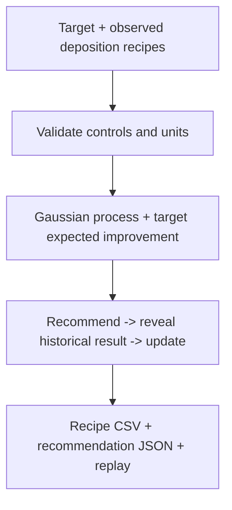

# DepoPilot

Project report | Harsh Saand | 22 September 2026

## The problem

Choosing a deposition experiment means balancing the desired rate against uncertainty about untried settings. DepoPilot recommends the next measured-recipe candidate and records what happens when its historical outcome is revealed.

## What a user gets

Enter a target rate and tolerance, import observations, inspect a recommended pulse recipe, export its settings and incorporate the next observation. The saved replay retains both an initial miss and a subsequent successful recommendation.

## Practical value

The retrospective comparison measures target-finding efficiency within a fixed pool of real experiments. It does not demonstrate a new film, equipment control or quality improvements. Greedy GP remains a strong comparator and slightly exceeds target EI on success rate.

## Logic and flow



<details>
<summary><strong>Data and license</strong></summary>

[Source DOI](https://doi.org/10.5281/zenodo.18495402), [full attribution and transformations](https://github.com/HarshSaand/depopilot/blob/c4a7ff79d321cc2ddc2bbc67a3890f63104047ff/data/ATTRIBUTION.md), [audit](https://github.com/HarshSaand/depopilot/blob/c4a7ff79d321cc2ddc2bbc67a3890f63104047ff/data/audit.json). Dataset: CC BY 4.0. Original project code: MIT. Author source code is not bundled. The source calibration is verified against the archive and authors' documented conversion.

</details>

<details>
<summary><strong>Method and leakage controls</strong></summary>

Matérn 5/2 Gaussian-process surrogate, fixed length scale 0.35 in declared-bound-normalised controls, white-noise variance 0.01 in normalised outcome space. Hyperparameters are fixed, not selected on hidden outcomes. Output normalisation uses observed responses only. Exact analytic expected improvement in absolute target error selects the next candidate. Candidate outcomes are passed into the model only after selection; no post-experiment peak current or batch index enters the features.

All 601 recipes pass campaign bounds and pulse timing (`negative width + positive delay + positive width < period`). Recipe repetitions are grouped before replay; the audited subset has none. Finite-pool replay exposes experimental candidate locations in advance, but hides their outcomes. It therefore measures retrospective search within this sampled pool, not fresh continuous-space optimisation or chronological reproduction of the authors' campaign. Only Al 120 W is supported in this release.

</details>

<details>
<summary><strong>Measured comparison</strong></summary>

20 paired seeds × 3 fixed absolute targets (0.5, 1.0, 1.4 Å/s); tolerance ±0.05 Å/s; 12 shared initial observations and 15 additional queries per run. Runs continue through the budget for final-error and interval evaluation, even after target attainment.

| Method | Target success within budget | Mean best error (Å/s) | Mean capped queries to first success |
|---|---:|---:|---:|
| Bayesian target EI | 88.3% | 0.0360 | 5.15 |
| Random | 70.0% | 0.0513 | 6.65 |
| Space filling | 73.3% | 0.0434 | 6.50 |
| Greedy GP | 90.0% | 0.0233 | 5.47 |

Initial successes count as zero additional queries; failures are capped at 16, so this is not the mean over successful runs only. BO beats random on these aggregates but **greedy slightly wins on success and final error**. Targets and seeds are not independent factory trials; no production yield or statistical significance claim is made.

Nominal 95% intervals cover only 74.4% of BO-selected outcomes: uncertainty is **under-calibrated**, and probability displays are model estimates. On a separate highest-PRR-quintile holdout (480 train / 121 test), MAE is 0.1222 Å/s, RMSE 0.1561 Å/s, interval coverage 89.3%. This held-out region is separate from sequential acquisition evaluation.

```sh
python -m pytest -q
OPENBLAS_NUM_THREADS=1 python scripts/evaluate.py
python scripts/make_example.py
# Optional regeneration from official source; ~396 MB download:
python scripts/download_data.py
```

Core tests validate the acquisition against numerical integration, hidden-outcome invariance, invalid/duplicate input rejection, and the import/reveal API.

</details>

<details>
<summary><strong>Actual outputs</strong></summary>

- [Recommendation JSON](https://github.com/HarshSaand/depopilot/blob/c4a7ff79d321cc2ddc2bbc67a3890f63104047ff/artifacts/recommendation.json) and [recipe CSV](https://github.com/HarshSaand/depopilot/blob/c4a7ff79d321cc2ddc2bbc67a3890f63104047ff/artifacts/recommendation.csv)
- [Initial measured observations](https://github.com/HarshSaand/depopilot/blob/c4a7ff79d321cc2ddc2bbc67a3890f63104047ff/artifacts/initial_observations.csv), accepted by the UI import
- [Revealed historical result](https://github.com/HarshSaand/depopilot/blob/c4a7ff79d321cc2ddc2bbc67a3890f63104047ff/artifacts/revealed_result.json)
- [Evaluation, every seed and objective](https://github.com/HarshSaand/depopilot/blob/c4a7ff79d321cc2ddc2bbc67a3890f63104047ff/artifacts/evaluation.json)
- [Held-out process-region evaluation](https://github.com/HarshSaand/depopilot/blob/c4a7ff79d321cc2ddc2bbc67a3890f63104047ff/artifacts/heldout_region.json)

The default first recommendation predicts 0.997 Å/s for a 1.000 ± 0.050 Å/s target. The actual recorded result is **0.660 Å/s**, outside tolerance. This visible failure is intentionally retained: a plausible-looking recommendation is not proof of process performance. Clicking “Recommend” again incorporates the new measurement. With the **same seed and observation sequence**, the second recommendation, AL120-0593, records **1.025 Å/s**, within the 1.000 ± 0.050 Å/s target. The [complete two-query trace](https://github.com/HarshSaand/depopilot/blob/c4a7ff79d321cc2ddc2bbc67a3890f63104047ff/artifacts/replay_trace.json) retains both the first miss and second success; no reseeding or example selection was used. The [first-miss screenshot](https://github.com/HarshSaand/depopilot/blob/c4a7ff79d321cc2ddc2bbc67a3890f63104047ff/artifacts/depopilot-result.png) remains available. The screenshot is generated from the running app, not a concept mockup.

</details>

<details>
<summary><strong>Run locally</strong></summary>

```sh
python3 -m venv .venv
source .venv/bin/activate
pip install -r requirements.txt
python app.py
```

Open http://127.0.0.1:8051. The small attributed CSV is bundled; downloading the 396 MB source archive is optional. This is a local Flask demonstration, not a production chamber-control service.

</details>

<details>
<summary><strong>Practical scope</strong></summary>

Recipe recommendations and historical observations are genuine software outputs. The system does not fabricate a film, generate a microscope image, or control equipment. Rate-only data does not establish uniformity, quality, yield or chamber safety. Exported settings require engineer/tool review before any physical use. The independent SEM Review project supplies the complementary image-based workflow; their datasets are not linked.

</details>

## Evidence and reproduction references

Source revision: c4a7ff79d321cc2ddc2bbc67a3890f63104047ff

- [README.md](https://github.com/HarshSaand/depopilot/blob/c4a7ff79d321cc2ddc2bbc67a3890f63104047ff/README.md)
- [artifacts/evaluation.json](https://github.com/HarshSaand/depopilot/blob/c4a7ff79d321cc2ddc2bbc67a3890f63104047ff/artifacts/evaluation.json)

This report describes the source and saved evidence at the revision above. Training and full benchmark runs were not repeated for this documentation release. Dataset, model and dependency licences remain separate from the project documentation.
